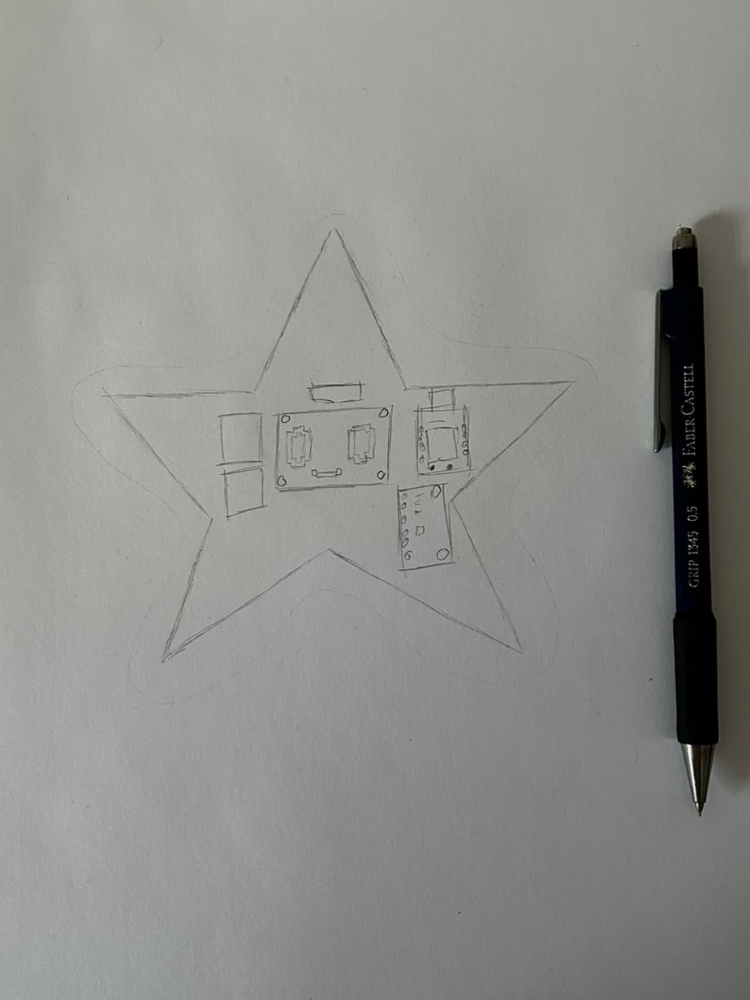
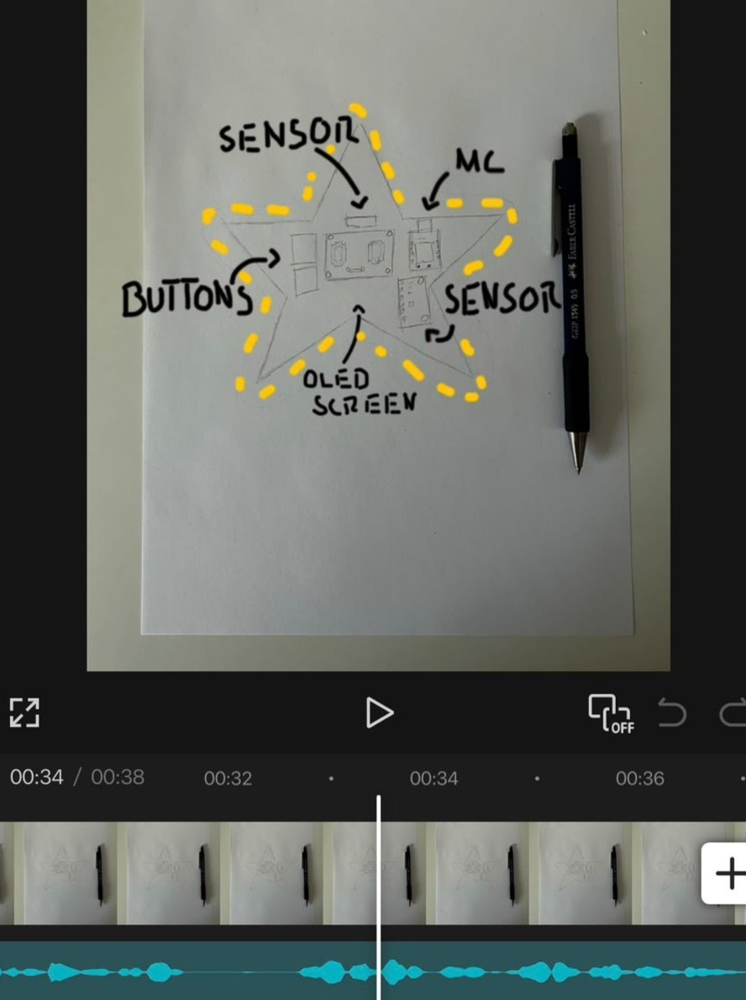

# Starbie — devlog

<!-- Generated by Half Life from project cmuv1fen70cdp01sm9gbzkrdt. Edits here are overwritten on the next sync. -->
<!-- Generated: 2026-10-06T18:12:11.501Z -->

> [!NOTE]
> This devlog is mirrored from [Half Life](https://halflife.hackclub.com). Editing it here will not change the platform's copy, and the next sync overwrites this file.

> A tiny motion-controlled digital pet, basically a desktop Tamagotchi. Totally not a Starboy.

| Week | Tier | Hours logged | Entries |
| --- | --- | --- | --- |
| Week 1 | Tier 1 | 2h | 1 |

## Contents

1. [2026-10-06 — # Making progress and brainstorming...](#2026-10-06-making-progress-and-brainstorming)

# Making progress and brainstorming...

Today I finally posted my first reel!
After some thinking and editing, I finally posted a real explaining my first project of the Program.

### Process

First, I thought about my project during the day and collected some ideas for the reel.
After sorting through my many thoughts I decided to get to work.

- took a picture of my sketch

	

- edited the photo and turned it to a video

	

- recorded the audio, added it
- exported the final product and posted

Usually, I find it difficult to make progress but today everything worked really well.

The recording actually took the longest because I kept stuttering. But after
rehearsing it a few times, it finally clicked.

### Next Steps

- Read the Starbie guide
- Start to planning and organizing
- Understand the project

**2h**
